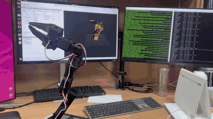

# Maker Faire 2026 SO-101 Teleoperation

<p align="center">
  
</p>

<p align="center"><em>MoveIt 2 계획 실행 → 실제 SO-101 follower 구동 → RViz 실측 자세 피드백</em></p>

LeRobot SO-101 기반 마스터-슬레이브 텔레오퍼레이션 프로젝트입니다. 기존 소개용
GitHub Pages와 함께, ROS 2 Humble에서 SO-101을 시뮬레이션하고 모션 플래닝할 수 있는
워크스페이스를 포함합니다.

## 포함 기능

- SO-101 URDF/Xacro 및 STL mesh
- RViz 모델 확인
- Gazebo Harmonic 시뮬레이션
- `ros2_control` 팔/그리퍼 trajectory controller
- MoveIt 2 및 위치 우선 KDL IK
- OMPL / Pilz / STOMP planning pipeline
- Gazebo + MoveIt + RViz 통합 launch
- 캘리브레이션된 실제 SO-101 follower용 MoveIt trajectory driver
- 모터 ID 설정, 캘리브레이션, 단일 관절 동작 확인용 경량 도구

## 저장소 구조

```text
.
├── index.html, styles.css, script.js  # 프로젝트 소개 웹사이트
├── assets/                            # 웹사이트 이미지
├── calibration/                       # 장치별 LeRobot 캘리브레이션 백업
├── tools/                             # ID/캘리브레이션/안전 동작 확인 도구
└── ros2_ws/                           # SO-101 ROS 2 워크스페이스
    ├── src/
    │   ├── so101_description/
    │   ├── so101_bringup/
    │   ├── so101_moveit_config/
    │   ├── gz_ros2_control/
    │   └── stomp_moveit/
    └── README.md                      # 설치·빌드·실행·설정 안내
```

## 빠른 실행

의존성 설치 등 전체 과정은 [`ros2_ws/README.md`](ros2_ws/README.md)를 확인하세요.

```bash
cd ros2_ws
source /opt/ros/humble/setup.bash
export GZ_VERSION=harmonic

colcon build --symlink-install \
  --packages-up-to so101_moveit_config \
  --cmake-args -DBUILD_TESTING=OFF -DBUILD_STOMP_EXAMPLE=OFF

source install/setup.bash
ros2 launch so101_bringup sim_moveit.launch.py
```

## 실제 follower + MoveIt 2

실제 하드웨어 경로는 기존 시뮬레이션 컨트롤러 이름을 유지합니다.

```text
RViz MotionPlanning
  → MoveIt move_group
  → /arm_controller/follow_joint_trajectory
  → so101_follower_driver.py
  → STS3215 ID 1~6
  → /joint_states
  → robot_state_publisher + RViz
```

토크 없이 연결, 캘리브레이션 일치 및 RViz 피드백부터 확인합니다.

```bash
cd ros2_ws
source /opt/ros/humble/setup.bash
source install/setup.bash
ros2 launch so101_bringup hardware_moveit.launch.py
```

실제 움직임을 허용할 때는 팔을 받치고 작업 공간과 전원 차단 수단을 확보한 뒤
명시적으로 토크를 활성화합니다.

```bash
ros2 launch so101_bringup hardware_moveit.launch.py \
  enable_torque:=true \
  auto_recover:=true
```

드라이버가 제공하는 인터페이스는 다음과 같습니다.

| 용도 | ROS 인터페이스 |
|---|---|
| 5축 팔 실행 | `/arm_controller/follow_joint_trajectory` |
| 그리퍼 실행 | `/gripper_controller/follow_joint_trajectory` |
| 실제 관절 피드백 | `/joint_states` |

드라이버는 JSON과 모터 내부 calibration을 비교하고, URDF radian 명령을 STS3215
encoder tick으로 변환합니다. 통신이 연속으로 실패하거나 전압 경보가 발생하면 진행 중인
trajectory를 중단합니다. 이후 6개 모터, calibration 및 안정된 전압을 확인하고 현재
자세를 먼저 목표값으로 기록한 다음 토크를 복원합니다. 실제 전압이 설정 한계에 가까우면
자동 복원하지 않습니다.

ROS 드라이버가 실행 중일 때 calibration 또는 전압 진단 프로그램을 함께 실행하면 같은
직렬 포트의 패킷이 충돌합니다. 진단 전에는 반드시 launch를 종료합니다.

검증 환경은 Ubuntu 22.04, ROS 2 Humble, Gazebo Harmonic 8.15입니다.

리더암 캘리브레이션 백업과 복원 방법은
[`calibration/README.md`](calibration/README.md)에 있습니다.

실제 follower는 `hardware_moveit.launch.py`로 연결합니다. 최초 실행 시에는 토크를
끄고 상태만 확인한 다음, 안전 공간을 확보하고 `enable_torque:=true`를 명시합니다.

## 진행 기록: 실패에서 실제 구동까지

1. **Gazebo ROS 패키지 탐색 실패**
   `ros_gz_sim` 및 `gz_ros2_control`을 찾지 못해 통합 launch가 시작되지 않았습니다.
   ROS 2 Humble과 Gazebo Harmonic 조합에 맞춰 `ros_gz` 바이너리와
   `gz_ros2_control` 소스 빌드를 분리해 해결했습니다.

2. **최신 LeRobot의 Python 버전 불일치**
   Ubuntu 22.04 기본 Python 3.10에서 최신 LeRobot이 요구하는 Python 3.12 조건을
   만족하지 못했습니다. 전체 ML 의존성을 설치하는 대신 Python 3.12 기반
   `.venv-calib`에 Feetech 통신과 calibration에 필요한 최소 패키지만 구성했습니다.

3. **팔 모터 ID 1~6 미검출**
   처음에는 모든 모터가 기본 ID이거나 기대한 ID와 달라 handshake가 실패했습니다.
   모터를 역순으로 하나씩 연결해 follower와 leader의 ID 1~6 및 baudrate를 설정했고,
   이후 전체 체인 handshake를 통과했습니다.

4. **Homing offset 표현 범위 초과**
   반 바퀴 homing 계산 중 STS3215 sign-magnitude 범위를 넘는 값이 발생했습니다.
   encoder wraparound를 처리하고 표현 가능한 범위로 제한하는 최소 calibration 도구로
   수정해 leader와 follower calibration을 완료했습니다.

5. **Calibration 파일 저장 성공**
   leader와 follower의 장치별 JSON을 각각 생성하고 저장소의 `calibration/`에
   백업했습니다. 모터 내부에는 homing offset과 limit이, PC에는 전체 장치 calibration
   JSON이 저장됩니다.

6. **단일 관절 실기 구동 성공**
   현재 위치를 먼저 목표값으로 시드한 뒤 `shoulder_pan`을 작은 각도로 움직였다가
   원위치하는 테스트를 구성했습니다. 사용자 확인, 이동량 제한 및 종료 시 토크 해제를
   포함해 실제 follower 동작을 확인했습니다.

7. **MoveIt 실행이 컨트롤러에서 거절됨**
   최초 실제 하드웨어 launch는 안전 기본값인 `enable_torque=false`였기 때문에 MoveIt
   trajectory가 정상적으로 거절됐습니다. 토크 활성화를 명시적 launch 인자로 분리하고,
   MoveIt의 기존 `FollowJointTrajectory` controller 이름을 실제 드라이버에 연결했습니다.

8. **직렬 포트 충돌**
   ROS 드라이버와 전압 진단 스크립트를 동시에 실행해 `Port is in use` 및 잘못된 상태
   패킷이 발생했습니다. 동일 포트를 단일 프로세스만 사용하도록 운영 절차를 정리하고,
   연속 통신 실패 시 안전하게 포트를 다시 여는 자동 복구를 추가했습니다.

9. **RViz/MoveIt과 실제 follower 통합 성공**
   MoveIt의 계획 trajectory가 실제 STS3215 모터로 전달되고, 측정된 여섯 관절 위치가
   `/joint_states`를 통해 RViz 모델에 반영되는 것을 상단 영상으로 확인했습니다.

10. **남은 이슈: 간헐적인 gripper 전압 경보**
    측정 전압은 전체 모터에서 약 `5.2~5.3V`, 설정 한계는 `4.0~8.0V`로 정상이지만
    ID 6 gripper가 간헐적으로 전압 경보를 보고했습니다. 케이블 교체 후에도 재현되어
    `5V 4A` 전원의 순간 전압강하와 gripper 모터 자체를 분리 점검 중입니다. 실제 전압이
    안정된 경우에만 현재 자세를 시드하고 토크를 복원하도록 드라이버를 보호했습니다.
